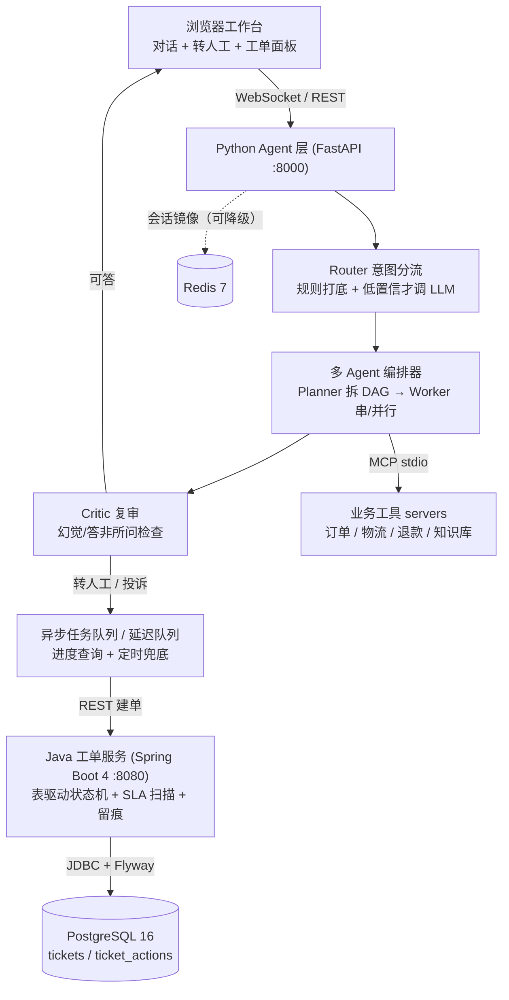

# AgentService · 电商售后 Multi-Agent 智能客服与工单闭环


**English summary**：A customer-service Agent for e-commerce after-sales, built end to end without an
agent framework. A hand-written orchestrator routes each message (Router → Planner → Worker → Critic)
and calls business tools over MCP (order / logistics / refund / knowledge base); unresolved cases are
escalated into a Java 21 + Spring Boot ticket state machine with SLA auto-escalation and an append-only
audit trail. Quality is measured, not claimed: dual-dataset intent evaluation (200 + 40 cases),
single- vs multi-agent comparison, a 12-item end-to-end acceptance suite, and load tests with a
multi-process scaling check.

> **时间说明**：2026.05 立项开发，2026.09 整理开源。
> 仓库不含任何密钥、真实业务数据与数据库文件；`.env` 需自行配置（无 Key 时规则引擎仍可跑评测与验收）。

## 架构



- Agent 层手写编排器：统一任务协议 `role / task / result`，全链路留痕可回放；内置 5 步上限、15s 工具超时、错误回喂、解析失败降级规则引擎。
- 工具层走 MCP 标准协议（6 个工具：订单查询 / 手机号查单 / 物流 / 退款资格 / 退款流程 / 知识库），与 Function Calling 方案做过对照。
- **行级权限**：工具入参里的身份由服务端注入（模型传入的 `actor_id` 一律被覆盖），MCP server 按订单归属校验，跨用户访问返回 **403**；会话与身份绑定（`session_id → user_id`）。
- **三层记忆**：工作记忆（最近 20 条，内存 + 文件 + Redis 镜像）、摘要记忆（工作记忆超 12 条时把较老消息压成摘要，避免窗口截断丢上下文）、长期偏好（用户级 `profiles.json`，跨会话保留）。
- Java 侧负责企业后端的确定性部分：表驱动状态机、非法跳转 409、`@Transactional` 原子留痕、SLA 超时自动升级。

## 快速开始（5 条命令）

> 权限与记忆的实测入口（服务起来后可直接验证）：
> ```powershell
> # 归属人问自己的订单 → 200
> curl.exe -s -X POST http://127.0.0.1:8000/api/chat -H "Content-Type: application/json" -d "{\"message\":\"我的订单到哪了\",\"session_id\":\"s1\",\"user_id\":\"u-1001\"}"
> # 换一个不是订单归属人的身份问同一句 → 403（行级权限）
> curl.exe -s -X POST http://127.0.0.1:8000/api/chat -H "Content-Type: application/json" -d "{\"message\":\"我的订单到哪了\",\"session_id\":\"s2\",\"user_id\":\"u-2002\"}"
> # 三层记忆视图 + 写用户长期偏好
> curl.exe -s http://127.0.0.1:8000/api/sessions/s1/context
> curl.exe -s -X POST http://127.0.0.1:8000/api/profile/u-1001 -H "Content-Type: application/json" -d "{\"回访偏好\":\"不要电话回访\"}"
> ```

前置：Python 3.11+（无需 Docker、无需 Java 即可跑通对话与评测，按需再补 Java 服务）。

```powershell
git clone https://github.com/JuiceGIO/AgentService.git
cd AgentService\backend
python -m venv .venv
.\.venv\Scripts\python -m pip install -r requirements.txt
Copy-Item ..\.env.example ..\.env; .\.venv\Scripts\python -m uvicorn app.main:app --port 8000
```

打开 <http://127.0.0.1:8000> 即是客服工作台。`.env` 里填 `OPENAI_API_KEY` 走 LLM 路由，不填则自动用规则引擎（功能可演示、评测可复现）。

可选：起 Java 工单服务（转人工自动建单/SLA 升级需要它）

```powershell
# 方式一：本地构建后运行（需 JDK 21 + Maven，详见 java-ticket-service/README.md）
cd java-ticket-service; mvn -q package; java -jar target\ticket-service-0.1.0.jar
# 方式二：容器一键编排（含 PostgreSQL/Redis，需先按上面命令构建一次 Java jar）
docker compose -p agentservice up -d --build
```

> 目录名含中文时 compose 无法推导项目名，务必带 `-p agentservice`。

## 评测结果

**意图识别 · 双数据集**（同一个 golden 卷上规则占优，人工语义卷上 LLM 占优，所以最终落地上线的是混合路由）

| 数据集 | 规则引擎 | LLM（DeepSeek） | 混合路由（现网默认） |
|---|---|---|---|
| 语义口径 200 条 | 96.0% | 96.5% | **99.0%**（LLM 触发率 23%） |
| 人工标注独立语义集 40 条 | 75.0% | 92.5% | **97.5%** |

混合策略：规则打底 → 难例/低置信度才调 LLM → 双方低置信且不一致时转人工。完整对比与结论见 `docs/llm-vs-rule-conclusion.md`。

**单 Agent vs 多 Agent**（18 个复合场景，全部可复现）

| 口径 | 单 Agent(ReAct) | 多 Agent(编排器) |
|---|---|---|
| 回答覆盖 | 100% | 100% |
| 转人工判定一致 | 94.4% | 94.4% |
| 工具错误率 | 0% | 0% |
| 平均步数 / 耗时 | 0.72 步 / 0.46s | 1.56 步 / 0.64s |

结论：复合咨询（如“这单能退吗”）用多 Agent 拆解换来信息完整性，简单咨询直接单 Agent——多耗 1.56 步 / 0.64s 买的是可解释的任务图与可回放留痕。

**压测 · 单进程 vs 多进程**（`scripts/load_test.py`，机器：Windows + Python 3.11 单进程 uvicorn）

| 并发 | Python `/ping` | 结论 |
|---|---|---|
| 50 | 300/300 成功 · RPS 594 · p50 66ms | 舒适区 |
| 200 | 300/300 成功 · RPS 293 · p50 504ms | 开始排队 |
| 500 | 300/300 成功 · RPS 198 · p50 1189ms | 单进程瓶颈 |
| 500（4 进程 + 请求均分） | 合计 **RPS ≈ 2624** · 各进程 p50 95–147ms | 约 12 倍吞吐、延迟降 90%+ |

> Windows 不支持 `uvicorn --workers 4`（socket 无法跨子进程传递），因此用 4 个独立进程模拟负载均衡；生产用 Linux 多 worker 或容器多副本。原始数据见 `docs/load_test_summary.md` 与 `docs/eval_reports/load_test_*.json`。

**全流程验收与质量门禁**

- `scripts/acceptance_12.py`：12 项端到端验收（健康检查/对话查物流/投诉自动建单/合法流转/非法 409/SLA 超时升级/异步与延迟任务/评测基线）实测 12/12 通过。
- `tests/`：44 个单元测试，全部零依赖、不联网、不需要 API Key。
- `.github/workflows/ci.yml`：push/PR 自动跑「单测 + 评测基线 + 安全审计」与「Java 构建 + compose 构建」两个 job。

## 踩坑记录（现象 → 根因 → 修复）

1. **Spring Boot 4 把 Flyway 拆成了独立模块**：只加 `flyway-core` 启动不建表（`relation "tickets" does not exist`），换成 starter 后又报 `Unsupported Database: PostgreSQL 16.15`。根因是 Boot 4 的自动配置与 Flyway 11 的数据库模块都改为按需引入，修复是显式加 `spring-boot-starter-flyway` + `flyway-database-postgresql`。
2. **加了 JDBC starter 后内存模式反而起不来**：报 `Failed to configure a DataSource`，因为 Boot 4 无条件装配 JDBC/Flyway 自动配置。修复是默认排除这些自动配置，再用 `@Profile("postgres")` 的配置类在 PG 模式重新引入，保住“零依赖演示 + 生产持久化”双模式。
3. **延迟队列的队头阻塞**：单队列 TTL + 死信队列方案下，一条长延迟消息会挡住后面所有短延迟消息（10s 的消息 16s 才到）。修复是加定时兜底扫描 + 消费端按业务状态幂等，并把进程内队列与外部队列统一成同一套 Job 状态模型，替换 transport 不影响业务。
4. **中文目录名让 `docker compose` 推导不出项目名**：`project name must not be empty`。修复是统一带 `-p agentservice`（或写 `COMPOSE_PROJECT_NAME`），并把这条写进 README 避免二次踩坑。
5. **数据库备份文件 `.bak` 被误提交**：开发期的 SQLite 备份混进版本库。修复是清理并让 `.gitignore` 覆盖 `*.db` / `*.sqlite3` / `*.bak` / `backup/`；现在仓库里没有任何数据库或备份文件。
6. **Windows GBK 控制台把验收脚本崩掉**：子进程输出解码报 `UnicodeDecodeError`，12 项验收里出现假失败。修复是子进程强制 UTF-8 输出 + 解码容错（`errors="replace"`），并把这些脚本纳入 CI 之外的一键门禁 `scripts/test_all.py`。
7. **500 并发把单进程上限暴露出来**：没有靠调大线程池掩盖，而是用 4 进程 + 请求均分实测 RPS≈2600，确认水平扩展方向（详见上方压测表）。

## 目录结构

```
backend/               Python Agent 层（FastAPI 入口 / Router / 编排器 / 队列 / 工单客户端）
  app/agent/           Router、ReAct、多 Agent 编排器、Critic
  app/static/          客服工作台页面（三栏：会话 / 对话 / 工单面板）
mcp_servers/           业务工具 MCP server（订单 / 物流 / 退款 / 知识库）
java-ticket-service/   Java 21 + Spring Boot 4 工单服务（状态机 / SLA / 留痕 / Flyway）
scripts/               评测、压测、验收、回归、安全审计脚本
tests/                 单元测试（零依赖、不联网）
docs/                  场景定案、演示脚本、压测与评测报告
```

## 技术栈与选型对标

- **Agent 编排**：手写编排器（Planner/Worker/Critic + 消息协议可回放）vs LangGraph——手写版原理透明、可观测、可深讲；生产默认 LangGraph，迁移边界写在设计里。
- **工具层**：MCP（协议标准化、跨语言复用）vs Function Calling（模型侧 schema 约定），本项目用 MCP，并把同一套工具的能力边界讲清楚。
- **会话**：内存 → 本地文件 → Redis 三级降级，评测与留痕可回放。
- **工单存储**：默认内存（演示零依赖）↔ PostgreSQL + Flyway（生产持久化）一键切换。
- **消息**：进程内任务/延迟队列（Job 状态模型与外部 MQ 同构）↔ Redis Stream / RabbitMQ，替换只动 transport。
- **双语言分工**：Python 负责 Agent 智能体，Java 负责状态机/事务/定时任务等企业后端，用 REST 契约解耦。
- 运行时：Python 3.11 · FastAPI · WebSocket · DeepSeek（OpenAI 兼容）· MCP · Java 21 · Spring Boot 4 · PostgreSQL 16 · Flyway · Redis 7 · Docker Compose

## License

MIT © 2026 Kewei Wang，详见 [LICENSE](LICENSE)。
